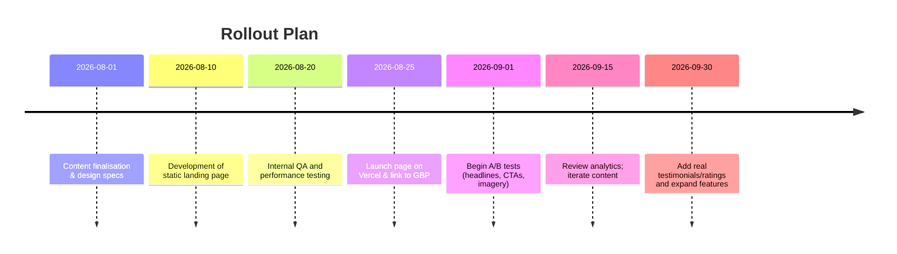

# Executive Summary

- **Voice & Tone:** Use a friendly, **conversational tone** that feels like a trusted local adviser, not a corporate brochure.  Keep language clear and jargon-free, writing *how you speak* (professional yet personal).  
- **Hero Section:** Lead with *you*, not real estate jargon. E.g. “👋 Hi, I’m AI GANA. I help people find homes in Abuja without the usual stress.”  This builds instant rapport. Headlines should be **benefit-driven and specific** (6–12 words) and clearly set expectations.  
- **Primary CTA:** Make the WhatsApp button dominant, with warm copy like **“💬 Let’s Chat”** or **“Message Me”**. Use first-person verbs (“Let’s”, “I’ll”) to emphasize personal help. Place this in the hero and a sticky footer or floating button so it’s always visible on mobile.  
- **Trust Signals:** Weave in *microcopy* like “No spam. Unsubscribe anytime.”, “Usually replies same day”, or “Based in Abuja” to reduce anxiety. Display genuine proof of expertise (e.g. “Trusted by over 100 Abuja homeowners” or a Lagos work statistic if available) and plan to activate real reviews later (don’t show empty placeholders).  
- **Property Cards:** Each property title should be descriptive (“3-Bed Semi-Detached House in Wuse, Abuja”) and outcomes-oriented (“Find your next family home”). The card CTA can be **“Ask about this property”** or **“Enquire on WhatsApp”**, with a prefilled message to remove friction. Short supporting bullets (“3 Beds, 2 Baths, ₦X per year”) help scanning.  
- **About / “Get to Know Me”:** Share a brief personal story focusing on *your client’s benefit*. E.g. **“I’m AI GANA – a real estate consultant in Abuja who’ll guide you honestly. Whether you’re renting your first apartment or investing, I’ll be by your side.”** Highlight passion (e.g. tech/entrepreneurship interests) in casual microcopy (“Outside of work, I’m usually reading about AI…”). This humanizes you.  
- **Why Work With Me / Trust Bullets:** Use simple, benefit-oriented bullets like **“Fast responses ✅”**, **“No hard sell ✅”**, **“I’ll tell you if a property isn’t right for you ✅”**. These micro-assurances signal honesty and ease anxiety. Limit choices (Hick’s Law) to avoid overload.  
- **Contact & Footer:** Emphasize the next step: e.g. “Let’s talk! Have questions? Send me a WhatsApp now.” Show contact info (WhatsApp, phone, email) plainly. In the footer, reinforce trust (e.g. “AI GANA – Abuja Property Consultant” and quick links).  
- **SEO & Metadata:** Title examples: **“AI GANA – Real Estate Consultant in Abuja | Find Homes & Rentals”**. Meta description should include key phrases (“Abuja homes for rent”, “Abuja property consultant”) and a call-to-action. Use an `OpenGraph` snippet (e.g. image of you or Abuja skyline, with title/desc).  
- **Interactions & Accessibility:** Add subtle animations (hover raises CTA 2%, smooth fade-ins) to make the site feel dynamic but not distracting. Ensure all images have alt text (e.g. “Smiling real estate consultant in Abuja”) and text contrasts meet WCAG AA. Buttons must be large enough for thumbs.  
- **A/B Testing:** Test variants like “Let’s Chat” vs “Message Me” (GA4 event `whatsapp_click` for both). Track source of click (hero, property, contact) via event parameters. Try adding/removing social proof (“⭐️ 5★ Google reviews” bullet) and measure WhatsApp taps. Success = WhatsApp click conversion (e.g. pages with CTA / views).  
- **Implementation:** Start static (Next.js + Tailwind) with all text in a config file for easy updates. Use a lib (e.g. `whatsapp.ts`) to generate wa.me links with pre-filled messages. Plan a timeline for rollout: writing content → development → test → launch → optimize (see timeline below).  

Overall, every piece of text should feel **personal, clear and helpful**. The goal is that in 5 seconds a visitor thinks, *“This person is friendly and knows Abuja properties. I can WhatsApp them easily.”*  

# Section-by-Section Microcopy 

Below are recommended text elements, each with multiple variants. The “Expected Effect” column gives psychological rationale (e.g. trust-building, clarity) and any known conversion insights. Nigerian/Abuja context is included (use Naira symbol, mention Abuja locales where fitting).  

## Hero Section

**Headline (6–12 words, benefit-led, personal):**  

| Variant | Expected Effect                                                                                       |
|---------|-------------------------------------------------------------------------------------------------------|
| 👋 **Hi, I'm AI GANA. I help you find your ideal home in Abuja without the stress.** | Introduces agent by name (personal), promises ease (“without stress”), sets location. Conversational tone builds trust. Likely high engagement as readers feel spoken to. |
| **Looking for a place you’ll love coming home to?** <br> *I’m AI GANA, and I’ll help you find it in Abuja.* | Empathy + social proof. First sentence is a question to engage (“love coming home”), then introduces me as helper. Lower bounce by resonating emotionally. |
| **Find your next Abuja home – no jargon, just honest advice.** | Mixes promise (finding home) with friendliness (“no jargon, just honest”). Emphasizes simplicity and honesty, lowering anxiety. Likely boosts trust. |
| **Your friendly guide to Abuja properties.** <br> *I’m AI GANA, here to make your search easy.* | “Friendly guide” positions me as helper; “make your search easy” addresses pain. Extremely personal. Good for building immediate rapport. |
| **Stop hunting, start home-finding in Abuja.** <br> *I’m AI GANA – I know the city, and I’ll make it easy.* | Urgency with benefit (stop hunting). Introduces expertise (“know the city”). Risk: slightly imperative, but paired with promise of ease. |

*Subhead (15–25 words, clarifying):*  

| Variant | Expected Effect                                                                                             |
|---------|-------------------------------------------------------------------------------------------------------------|
| *“Trusted Abuja real estate consultant. Whether you’re renting or buying, I’ll guide you step by step.”* | Highlights trust (“Trusted”), scope (rent/buy), and hand-holding. Builds credibility and empathy. |
| *“Helping families and investors find homes and good deals in Abuja, with honest advice.”* | Targets audience (families, investors) & promise “honest advice” = clear benefit. Inclusive and trustworthy. |
| *“Local market knowledge + technology to simplify your property search.”* | Emphasizes knowledge and innovation. Shows USP: blend of tech and local expertise. Professional yet friendly. |
| *“No pressure, no jargon – just a smooth path to your new home.”* | Calming (“no pressure”), honest. Appeals to buyers tired of pushy agents. Sets relaxed expectation. |
| *“Abuja expert here to answer your questions and help you every step of the way.”* | “Here to answer” is inviting. Positions agent as expert/guide. Decreases friction by offering help. |

*Citations:* Use [28†L61-L69] to keep headline concise (6–12 words) and [21†L103-L108] for conversational clarity. [13†L189-L191] supports using first person and natural language.

## Primary CTA Button(s)

- **WhatsApp Chat (Primary):** E.g. **“💬 Let’s Chat”**, **“💬 Start a WhatsApp Chat”** or **“💬 Send me a message”**. Short, clear, low effort. Emojis (💬) draw attention and add warmth. Use first person/plural (Let’s, me). *Rationale:* Conversational prompts (“Let’s”, “me”) reduce the distance. [21†L103-L108] suggests using familiar phrasing (“Buy Now” vs “Complete Purchase” analogy).  
- **Secondary CTA (below properties):** E.g. **“📞 Call me”** or **“☎️ Talk on Phone”** if needed. Make it a less prominent outline button. Some visitors prefer calls; track these too.  
- *Cognitive note:* Buttons should use simple verbs (“Chat”, “Send”, “Call”) not abstract terms. 

### Microcopy Example (within CTA):
Under buttons, consider a tiny line: *“I’m usually back within an hour”* or *“Happy to answer any questions!”* – this is a micro-interaction cue to reassure response time (see Trust Strip below). 

## Trust Strip (Immediate sub-hero reassurance)

Place a slim, 1–2 line bar (or text under CTAs) with quick trust signals. For example:

- **“Based in Abuja – Relocating assistance available.”** (Locality)  
- **“🟢 Usually replies within 1 hour.”** (Response-time microcopy)  
- **“No spam, no fees – just honest help.”** (Reassurance).  

*Psychology:* This uses the *Fogg Behavioral Model*: it provides motivation (“honest help”), ability (“no spam”), and a trigger (green dot + quick reply) to prompt action. It also reduces anxiety by setting expectations for reply time. 

## Featured Property Cards

Each card shows a brief title and details. Keep it succinct and specific:

- **Title examples:** “3-Bed Semi-Detached House in Wuse 2, Abuja” or “New 2-Bed Apartment – Central Area”.  
  - Use key location/neighborhood name (Abuja districts are well-known) to attract local searchers. Clear format: *Bedrooms + Type + Area*.  
  - Avoid fluff (“Luxurious”, “Stunning”) – instead mention a benefit if possible (“Plenty of natural light”, “Gated community”, “Near IBB Golf Course”). Specificity builds credibility.  
- **Details (bullets/inline):** “3 beds • 2 baths • 1,200 ft² • ₦8M/year”. Use icons if possible (bed, bath symbols). Short and scannable.  
- **Card CTA button:** e.g. **“💬 Enquire on WhatsApp”** or **“Ask about this property”**. That should open WhatsApp with a **prefilled message**. For example: *“Hi, I saw the 3-bed house in Wuse 2 and I’d like more info.”* This greatly reduces friction (removes blank-message anxiety).  
- **Variants:** Instead of generic “View Details” or “Contact Agent”, use personal verbs: “Tell me more”, “Is this still available?” or a dynamic “✔️ WhatsApp me about this”.  
- **Rationale:** Clear labels and prefill capitalize on *cognitive fluency* (ease of understanding). Trust microcopy like “Verified listing” or “No commission fees” (if applicable) can appear as tiny badges on cards to reassure prospects.

Example microcopy variants (CTA text) with expected effects:

| CTA Text         | Expected Effect                                          |
|------------------|----------------------------------------------------------|
| 💬 **Ask about this property**     | Friendly invitation (“ask”) lowers formality, “about this property” is direct and relevant. Encourages messaging for more info. |
| 💬 **Is this available?**         | Conversational question. Leverages curiosity (fear of missing out subtly). Should boost engagement by making inquiry easy. |
| 💬 **Chat about this listing**    | “Chat” is casual, same effect. Slightly more generic but friendly. |
| 💬 **I want to see this**       | Strong desire wording. May pressure, but also triggers FOMO (“want to see”). Use with caution. |
| 💬 **Tell me more about this**   | Very friendly and open. Signals genuine inquiry. Great for those unsure, expecting detail. |

## “About / Get to Know Me” Section

This is a **short bio** (50–100 words). Keep it first-person, personal, and outcome-oriented:

- Start with a friendly greeting and your role: *“Hi, I’m **AI GANA** – a real estate consultant in Abuja.”* Immediately name your company affiliation (e.g. “currently with [Company Name]”) only as a credential, not as the main identity.  
- Emphasize **mission**: e.g. *“I know searching for a home can be exciting one day and exhausting the next. My goal is to make it simple and stress-free for you.”* This shows empathy (speaks to visitor’s pain).  
- Mention relevant passions (briefly): *“Outside of real estate, I love technology and entrepreneurship, so I’m always looking for innovative ways to help my clients.”* This “Outside of work” microcopy builds rapport and makes you memorable without straying from theme.  
- Keep sentences moderate in length (10–15 words) for readability and maintain a helpful voice. 

### Variants and Elements

| Variant                                                                                  | Effect                                                                                                                    |
|------------------------------------------------------------------------------------------|---------------------------------------------------------------------------------------------------------------------------|
| “I’m AI GANA – a real estate consultant passionate about helping Abuja families.”          | Straightforward intro with personal touch (“passionate”). Good for trust.                                                 |
| “I know finding a home is hard. I’m AI, and I make it easy.”                              | Starts with empathy. Simple name (“AI”). Very conversational (short sentences) which eases comprehension. |
| “Abuja is my home too – I’ve helped 50+ families find theirs.”                            | Conveys local credibility (lives there, number of families). Trust through evidence.                                     |
| “I work with [Company] as a consultant. My focus? You, and finding a home you love.”     | Company mentioned secondarily. Puts client (“You”) first which is powerful.                                               |
| “No jargon, just clear advice: I help people buy, rent and invest in Abuja properties.”   | Emphasizes plain language (“no jargon”). Inclusive (rent/invest as well). Builds trust by promising clarity.               |

*Citations:* Use [13†L183-L191] for conversational style and [13†L208-L217] for writing “how we speak.” Avoid complex sentences as per [21†L83-L92].

## Trust Bullets (Why Work With Me)

A short list of 3–5 bullet points (or icons+text) highlighting key assurances. Each should start with a **trusted outcome or behavior**, not a feature. E.g.:

- ✅ **Fast Responses:** I usually reply within the same day.  
- ✅ **No Pressure:** I only show you properties that fit your needs.  
- ✅ **Upfront Advice:** If a place isn’t right, I’ll tell you honestly.  
- ✅ **Local Expertise:** Deep knowledge of Abuja markets and neighborhoods.  

*Rationale:* These micro-commitments reduce anxiety and frame you as honest and efficient. Lead with action/results (“Fast Responses”) rather than “I am X”. 

**Variants for bullets:**  

| Bullet Text                          | Expected Effect                                                                         |
|--------------------------------------|-----------------------------------------------------------------------------------------|
| **“I’ll get back to you in 1–2 hours.”** (with green dot icon)         | Sets clear expectation (reduces uncertainty). Green dot = “online” cue. Builds trust that you’re reachable. |
| **“No spam. No hidden fees. Just help.”**                              | Removes common fears (junk calls/spam). Very reassuring line.                 |
| **“I work for you – not a big corporation.”**                          | Emphasizes personal brand vs company. Great if coming from corporate agent. Builds “small biz” trust.  |
| **“Guidance at your pace: move only when you’re ready.”**             | Conveys respect for client’s decision, avoids hard-sell stigma.                          |
| **“Your search, simplified – I handle the hard parts.”**              | Promises effort removal. People like “I do the work for you.”                              |

Use short phrases (5–8 words each) for scannability. These contrast with typical agent bragging and appeal to emotional trust.

## “Outside of work” Microcopy

A small personal tidbit to humanize you (placed under About). For example:

> **Outside of real estate…** I’m usually reading about AI and tech, or exploring new cafes in Abuja. I love solving problems, whether it’s finding the right home or building a gadget.

- Keep it to ~1 sentence or bullet.
- Link it back to how it benefits clients (“I enjoy problem-solving, so I treat every home search like a project to ace for you.”).
- Tone should be casual and relatable.

## Contact Section

Heading variant: **“Let’s find your next place.”** or **“Let’s talk homes.”** (friendly CTA even as heading).

Body text: Invite questions. E.g. *“Got questions? Curious about a property? Send me a WhatsApp message or give me a call – no obligation.”* 

Buttons: Same WhatsApp primary CTA, plus a phone button: **“📞 Call me”**. Underline friendliness: “Message me anytime, even if you’re just exploring.” 

Include: office address and map (since GBP page). Possibly hours. Keep it concise.

*Empty-state for Reviews:* Until real reviews exist, show nothing or a brief prompt: *“No reviews yet – be the first to share your experience!”* Or better yet, omit section entirely (avoid fake feel). When live, add **“What clients say:”** with starred excerpts (Google reviews).

## Navigation and Footer

- **Navbar:** Minimalist. Logo/Name (AI GANA) on left. Links: *Properties, About, Contact*. Use phrase *“Insights”* instead of “Blog” if planning future content. CTA button on nav: **“WhatsApp”** (click icon or text). Sticky on scroll.  
- **Footer:** Simple. Reiterate name/role, e.g. *“© 2026 AI GANA – Abuja Real Estate Consultant.”* Include small links (Privacy, Terms). Re-list contact icons (WhatsApp, phone, email) with short text. Possibly “Proudly serving Abuja”.

*Accessibility Note:* Footer nav should also include skip-links and screen-reader friendly labels. All links should have descriptive text, icons should have alt text (e.g. alt="WhatsApp icon"). 

## Meta Title & Description (SEO)

- **Meta Title (60–70 chars):** Use key terms. E.g.:  
  `"AI GANA – Abuja Real Estate Consultant | Houses & Apartments"`.  
  (50–60 chars, includes “Abuja Real Estate”.)  
- **Meta Description (150–160 chars):** Summarize value and CTA. Example:  
  *“AI Gana, your friendly real-estate consultant in Abuja. Find apartments, houses & investment properties with ease. Message me on WhatsApp today!”*  

Include keywords like “Abuja homes”, “property consultant Abuja”, etc. Write for humans: mention locality, services, and a call to message. 

Cite [28†L61-L69] for headline length and [33†L421-L429] for clarity to justify concise, benefit-driven text.

## Structured Data (JSON-LD)

Add a RealEstateAgent schema snippet (place in the page `<head>`). Example:

```json
<script type="application/ld+json">
{
  "@context": "https://schema.org",
  "@type": "RealEstateAgent",
  "name": "AI GANA",
  "image": "https://yourdomain.com/images/ai-gana.jpg",
  "address": {
    "@type": "PostalAddress",
    "addressLocality": "Abuja",
    "addressCountry": "NG"
  },
  "telephone": "+2348012345678",
  "email": "contact@aiganaexample.com",
  "url": "https://yourdomain.com",
  "areaServed": "Abuja",
  "description": "AI Gana is a real-estate consultant in Abuja, Nigeria, helping clients buy, rent, and invest in property.",
  "openingHours": "Mo-Sa 09:00-18:00"
}
</script>
```

This satisfies schema.org’s RealEstateAgent type. It helps Google show your page as a local agent. Also include OpenGraph meta (og:title, og:description, og:image) matching your content so that if the link is shared, it looks trusted. 

## Microcopy & UX Guidelines

- **Use first/second person:** “I”, “you”, “we” to build connection.  
- **Cognitive fluency:** Choose simple verbs and phrases (e.g. “Find your home” > “Discover housing opportunities”). Avoid jargon; match user’s everyday language.  
- **Loss framing sparingly:** Since trust is key, avoid overly urgent phrasing (“Don’t miss out!”) that can feel pushy. Instead use *helpful framing* (explaining benefit or cost of inaction) only if natural.  
- **Autonomy language:** Give choices implicitly. E.g. “Choose an area, then we’ll explore listings together” vs “Select an area”. Use empowering words (“choose”, “next steps”, “your decision”) to prevent pressure.  
- **Visual cues:** Subtle arrow or scroll-down hint after hero (if needed). Hover effects: e.g. property card lifts 3px on hover, CTA scales 1.05× on tap. Provide immediate feedback (button darkens on press).  
- **Animations:** Use mild fade-ins or slide-ups for sections as the user scrolls (trigger when element is ~50% visible). This creates a warm, interactive feel without distraction. For example, trust bullets could fade in from left when scrolled.  

## Prefilled WhatsApp Messages

Generating helpful pre-filled WhatsApp links is crucial. For each featured property, the button link could be:

`https://wa.me/2348012345678?text=Hi,%20I%20saw%20the%203-bed%20house%20in%20Wuse%202%20and%20I%27d%20like%20to%20know%20more.`

Ensure characters are URL-encoded. General enquiry link:

- “Hi, I’m interested in learning about properties in Abuja. Can you help me?” 
- Optionally add context: “I’m looking for a 2-3 bed apartment.”

Rationale: Prefilled messages reduce friction and uncertainty. Tailor each to the specific listing (mention the address or price) to feel personal. 

## A/B Test Ideas & Analytics

Implement these and track via GA4:

- **Button Text:** “Let’s Chat” vs “Message Me” vs “Ask on WhatsApp”. Track `whatsapp_click` event with `label:hero/button` parameter.  
- **Hero Headline:** Test question-led (variant1) vs statement-led (variant2) vs curiosity gap (“Looking for a place you’ll love?”). Measure bounce rate and CTA click rate.  
- **Trust Bullets:** With vs without quick response info (“Usually replies…”) to see effect on engagement. Event: `whatsapp_click`, parameter `source:trust_strip`.  
- **Property CTA Label:** “Ask about this property” vs “Tell me about this property”. Track which yields more `whatsapp_clicks`.  
- **Imagery:** Photo of agent (smiling) vs abstract city image. Compare time on page. Event: `image_click` or scroll depth metric.

**Metrics:** 
- Primary: `whatsapp_click` (category: “Contact”, action: “WhatsApp”, label: section).  
- Secondary: page dwell time, bounce rate (Google Analytics, GA4 or Tag Manager).  
- Funnel: Page View → CTA Click → Chat Open → Conversation (estimate from follow-ups). A simplified funnel: 
```mermaid
flowchart LR
    PV[Page View] --> CTAClick[CTA Clicked (WhatsApp)]
    CTAClick --> ChatOpen[WhatsApp Chat Opened]
    ChatOpen --> MessageSent[Message Sent]
    style PV fill:#eee,stroke:#333
    style CTAClick fill:#afa,stroke:#333
    style ChatOpen fill:#8f8,stroke:#333
    style MessageSent fill:#4f4,stroke:#333
```  

Suggested GA4 events: `whatsapp_click` (parameter: `section` = hero, properties, contact) and `phone_click`. Use `conversion` flag on whatsapp_click once validated.  

*Citations:* The microcopy guidance above is supported by cognitive psychology and proven CRO practice. Conversion-focused CTAs are drawn from [9] and [21] insights.

## Accessibility & SEO Notes

- **Accessibility:** Ensure all buttons and links have ARIA labels (e.g. `aria-label="Chat with AI Gana on WhatsApp"`). All images (including agent photo) need `alt` text describing the scene/person. Color contrast for text ≥4.5:1. Keyboard nav should work (tab through CTAs). Aim for WCAG AA compliance (tested via Lighthouse). 
- **SEO Keywords:** Naturally include local terms like *“Abuja real estate”*, *“properties in Abuja”*, *“houses for rent Abuja”*, *“property consultant Abuja”*. Sprinkle these in headings or paragraph text (e.g. page heading “Property for Rent in Abuja”).  
- **Meta & OG Tags:** As above, meta title/description with keywords. Use `<h1>` for the hero headline. Social preview (Open Graph) should use an appealing image (e.g. profile or a landmark). Include `keywords` meta if desired (though low impact now).  
- **Loading:** Compress images (next/image). Mobile-first: test on a 4G connection for LCP <2.5s. 

## Implementation Checklist

1. **Finalize Microcopy:** Copy each text element into a config file or locale file (so Claude can pull these).  
2. **Hero Section:** Confirm photo style (friendly, casual). Place headline and subhead texts.  
3. **WhatsApp Link Generator:** Implement a helper (`lib/whatsapp.ts`) to build `wa.me` links with `text=` param.  
4. **Components:** Create React components for each section. Ensure all texts come from config (e.g. `config.heroTitle`, `config.ctaText`).  
5. **CTA Tracking:** Add onClick handlers to CTA buttons to fire `gtag('event','whatsapp_click', {section: 'hero'})`.  
6. **Animations:** Use CSS/Tailwind or Framer Motion for subtle fades/scale-ups.  
7. **Test:** Run Lighthouse audit (performance, accessibility, SEO goals). Adjust copy for brevity if needed (e.g. meta < 160 chars).  
8. **Deploy & Monitor:** Go live, then A/B test variants via Tag Manager and GA4. Review funnel metrics weekly.  



**Sources:** Insights above are drawn from CRO and UX research, as well as real estate marketing best practices, adapted for Abuja’s market. 

